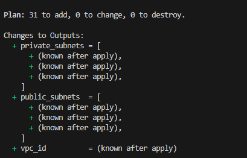

# ECS Fargate Deployment with Terraform and GitLab CI/CD

## Table of Contents
1. [Overview](#overview)
2. [Project Architecture](#project-architecture)
3. [Getting Started](#getting-started)
4. [Modules](#modules)
   - [Terraform Backend](#terraform-backend)
   - [Networking](#networking)
   - [ECS Infrastructure](#ecs-infrastructure)
5. [GitLab CI/CD Setup](#gitlab-cicd-setup)
6. [Application Details](#application-details)
7. [File Structure](#file-structure)
8. [Additional Notes](#additional-notes)

---

## Overview
This project automates the deployment of a containerized Python application on **AWS ECS Fargate** using **Terraform** for infrastructure provisioning and **GitLab CI/CD** for continuous integration and delivery.

### Key Features
- **Modular Terraform Setup**: Backend, networking, and ECS modules for scalability.
- **CI/CD Pipeline**: Automates Docker image build, push to ECR, and deployment to ECS.
- **Dev and Prod Environments**: Isolated environments with dedicated ALB configurations.
- **TLS Support**: Secure HTTPS setup using ACM and Route 53.

---

## Project Architecture


---

## Getting Started

### Prerequisites
- **AWS CLI** installed and configured.
- **Terraform** (>= 1.6.0).
- **GitLab Account** with necessary permissions.
- **Docker** installed locally for testing builds.

### Steps
1. Clone the repository:
```bash
git clone https://github.com/sahibgasimov/ecs-gitlab-terraform.git

cd ecs-gitlab-terraform
```

### Modules

```tree
├── backend/           # Terraform backend module
├── networking/        # VPC and networking module
├── ecs/               # ECS cluster and services module
├── images/            # Architecture and CI/CD images
├── app/               # Python application code
├── .gitlab-ci.yml     # GitLab CI/CD pipeline
└── README.md          # Project documentation
```

### Terraform Backend

This repository contains a Terraform configuration to manage state files and locking using AWS S3 and DynamoDB. It sets up an S3 bucket for state file storage and a DynamoDB table for state locking.

---

#### Features

- **S3 Bucket**: Stores the Terraform state file.
  - Versioning is enabled for safety.
  - Configured to allow state storage with high reliability.
- **DynamoDB Table**: Provides state locking to prevent race conditions in multi-user environments.

---

### How It Works

1. **Manual S3 Bucket Creation**:
   - Before running Terraform, create the S3 bucket manually to ensure the bucket is not accidentally destroyed by Terraform.

2. **Local to Remote State Migration**:
   - Initially, the state is stored locally. After running Terraform to create required resources (S3 and DynamoDB), the backend is updated to use the S3 bucket for remote state storage.

## Installation and Usage

### Step 1: Initialize and Apply Configuration with Local Backend

1. Clone the repository:
```git
git clone https://github.com/sahibgasimov/ecs-gitlab-terraform.git
cd backend
```
Initialize Terraform:

```hcl
terraform init
terraform apply
```

### Step 2: Configure Remote Backend with S3
Uncomment the following block in main.tf and run terraform apply to create backend module. Once created update your existing s3 bucket to migrate state file to s3 bucket. 

```
terraform {
  backend "s3" {
    bucket         = "my-project-terraform-state-prod"  # Replace with your S3 bucket name
    key            = "backend/terraform.tfstate"      
    region         = "us-east-1"                      
    dynamodb_table = "my-project-terraform-lock"       
    encrypt        = true
  }
}
```
 

Migrate the state file to the S3 backend:

```hcl
terraform init -migrate-state
```


#### File Structure
```

├── main.tf             # Main configuration file
├── variables.tf        # Input variables
├── terraform.tfvars    # Variable values
├── outputs.tf          # Outputs for debug and reference
├── README.md           # Project documentation
```


#### Notes
- Create S3 remote state bucket manually to prevent accidental deletion.
- The backend configuration uses versioning for safety and state locking for consistency.
- Dynamodb table locks Terraform state files to prevent concurrent modifications.

### Networking

# VPC Module for ECS Cluster

This module configures a Virtual Private Cloud (VPC) for the ECS cluster, including private and public subnets, NAT gateway, and necessary configurations.

---


## Features

- **VPC Creation**:
  - CIDR block: `10.0.0.0/16`
  - Public and private subnets across availability zones.
- **NAT Gateway**:
  - Enabled for outbound internet access from private subnets.
- **Tagging**:
  - Tags for environment and project are applied.

---

## Prerequisites

- Ensure the backend S3 bucket and DynamoDB table for Terraform state are already configured.
- AWS credentials must be set up for the specified region.

---

## File Structure

```plaintext
.
├── main.tf             # Defines the VPC module and its configurations
├── provider.tf         # Configures the AWS provider and backend
├── variables.tf        # Declares input variables
├── terraform.tfvars    # Defines variable values
├── outputs.tf          # Exports outputs such as subnet and VPC IDs  

```
### Usage

```
terraform init
terraform apply
```



### Notes
- The terraform-aws-modules/vpc module is used to simplify VPC creation.
- Ensure availability zones in your region support the configuration.