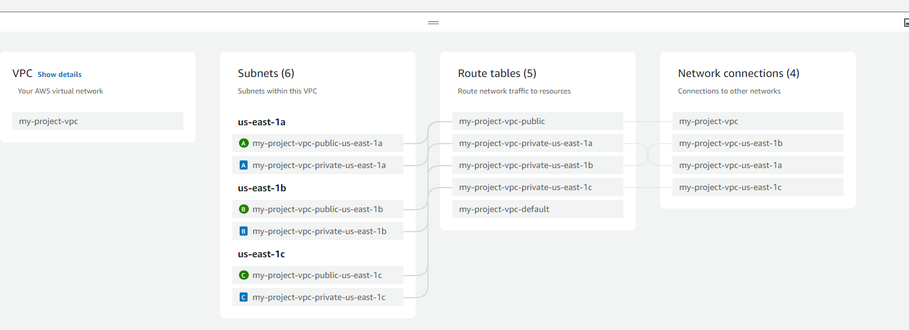
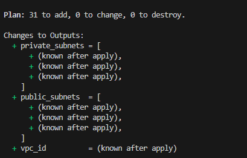

# VPC Module for ECS Cluster

This module configures a Virtual Private Cloud (VPC) for the ECS cluster, including private and public subnets, NAT gateway, and necessary configurations.

---



## Features

- **VPC Creation**:
  - CIDR block: `10.0.0.0/16`
  - Public and private subnets across availability zones.
- **NAT Gateway**:
  - Enabled for outbound internet access from private subnets.
- **Tagging**:
  - Tags for environment and project are applied.

---

## Prerequisites

- Ensure the backend S3 bucket and DynamoDB table for Terraform state are already configured.
- AWS credentials must be set up for the specified region.

---

## File Structure

```plaintext
.
├── main.tf             # Defines the VPC module and its configurations
├── provider.tf         # Configures the AWS provider and backend
├── variables.tf        # Declares input variables
├── terraform.tfvars    # Defines variable values
├── outputs.tf          # Exports outputs such as subnet and VPC IDs  

```
### Usage

```
terraform init
terraform apply
```



### Notes
- The terraform-aws-modules/vpc module is used to simplify VPC creation.
- Ensure availability zones in your region support the configuration.